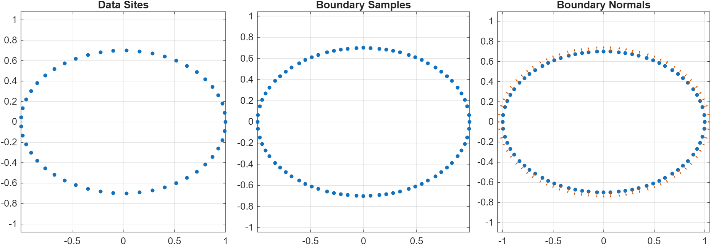
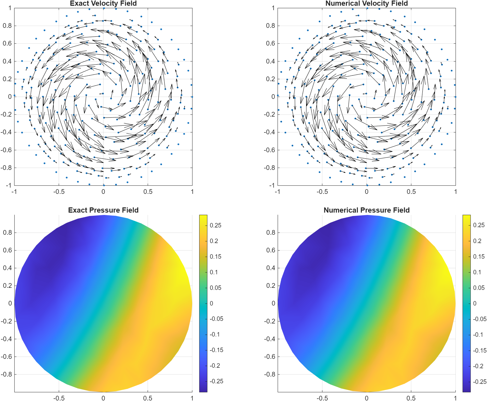

# kernelpack-matlab

`kernelpack-matlab` is a MATLAB companion project to
[KernelPack](https://github.com/VarShankar/kernelpack).

It brings the main geometry, node-generation, polynomial, RBF-FD, and solver
ingredients of KernelPack into a MATLAB codebase that is easier to inspect,
prototype with, and extend.

## What it includes

- Geometry objects for smooth and piecewise-smooth boundaries and surfaces:
  `EmbeddedSurface`, `PiecewiseSmoothEmbeddedSurface`, and `RBFLevelSet`
- Seeded fixed-radius Poisson node generation in axis-aligned boxes, with
  geometry-aware clipping and boundary refinement through `DomainNodeGenerator`
- A compact `DomainDescriptor` for interior, boundary, ghost nodes, normals,
  and nearest-neighbor search structures
- Shared polynomial utilities in `kp.poly`, including Legendre-based
  `PolynomialBasis`
- RBF-FD and weighted least-squares stencil and assembly classes in `kp.rbffd`
- Fixed-domain `PoissonSolver`, `VariablePoissonSolver`, and `DiffusionSolver`
- PU diffusion and PU-SL transport-coupled solvers:
  `PUDiffusionSolver`, `MultiSpeciesPUDiffusionSolver`,
  `PUSLAdvectionSolver`, `MultiSpeciesPUSLAdvectionSolver`,
  `PUSLFDAdvectionDiffusionSolver`, `PUSLPUAdvectionDiffusionSolver`,
  `PUSLFDAdvectionDiffusionReactionSolver`, and
  `PUSLPUAdvectionDiffusionReactionSolver`
- Dual-domain PU-SL incompressible Euler stepping through
  `PUSLIncompressibleEulerSolver`, backed by an internal Euler BDF backend

The main packages live in:

- [`+kp/+geometry`](+kp/+geometry)
- [`+kp/+nodes`](+kp/+nodes)
- [`+kp/+domain`](+kp/+domain)
- [`+kp/+poly`](+kp/+poly)
- [`+kp/+rbffd`](+kp/+rbffd)
- [`+kp/+solvers`](+kp/+solvers)

## Supported workflows

- Smooth closed curves and smooth closed 3D surfaces
- Open curve segments and open 3D surface patches
- Piecewise-smooth planar boundaries and piecewise 3D surfaces
- Fixed-radius Poisson disk sampling in any dimension
- Level-set clipping of box clouds to geometry-defined domains
- Standard and overlapped RBF-FD assembly
- Fixed-domain Poisson solves
- Fixed-domain variable-coefficient Poisson solves
- Fixed-domain diffusion stepping with BDF1, BDF2, and BDF3
- PU semi-Lagrangian advection on fixed domains
- PU diffusion stepping with BDF1, BDF2, and BDF3
- Coupled PU-SL advection-diffusion with either FD or PU diffusion
- Coupled PU-SL advection-diffusion-reaction with either FD or PU diffusion
- Dual-domain incompressible Euler stepping with PU-SL velocity transport

## MIP install

This repo includes a [`mip.yaml`](mip.yaml), so it can be installed as a
local [MIP](https://mip.sh/) package.

Install MIP in MATLAB:

```matlab
eval(webread('https://mip.sh/install.txt'))
```

Install this repo from a local checkout:

```matlab
mip install -e E:/kernelpack-matlab
mip load kernelpack_matlab
```

Run the package check:

```matlab
mip test kernelpack_matlab
```

## Status

The current MATLAB implementation includes the main numerical layers that sit
underneath typical KernelPack-style workflows:

- geometry fitting and level-set construction
- domain node generation
- polynomial bases and multi-index utilities
- local RBF-FD and weighted least-squares stencils
- sparse operator assembly
- fixed-domain Poisson and diffusion solvers

The project is still organized around KernelPack-style workflow pieces rather
than a separate MATLAB abstraction stack. The aim is to make the core methods
easy to inspect and prototype with while keeping the overall contracts close to
the broader KernelPack direction.

## Examples and checks

Examples:

- [`examples/geometry_examples.m`](examples/geometry_examples.m)
- [`examples/nodes_examples.m`](examples/nodes_examples.m)
- [`examples/poisson_solver_example.m`](examples/poisson_solver_example.m)
- [`examples/variable_poisson_solver_example.m`](examples/variable_poisson_solver_example.m)
- [`examples/poisson_solver_example_3d.m`](examples/poisson_solver_example_3d.m)
- [`examples/diffusion_solver_example.m`](examples/diffusion_solver_example.m)
- [`examples/pu_diffusion_convergence_2d.m`](examples/pu_diffusion_convergence_2d.m)
- [`examples/multispecies_pu_diffusion_convergence_2d.m`](examples/multispecies_pu_diffusion_convergence_2d.m)
- [`examples/pusl_advection_rotation_convergence_2d.m`](examples/pusl_advection_rotation_convergence_2d.m)
- [`examples/pusl_multispecies_convergence_2d.m`](examples/pusl_multispecies_convergence_2d.m)
- [`examples/pusl_fd_advection_diffusion_convergence_2d.m`](examples/pusl_fd_advection_diffusion_convergence_2d.m)
- [`examples/pusl_pu_advection_diffusion_convergence_2d.m`](examples/pusl_pu_advection_diffusion_convergence_2d.m)
- [`examples/pusl_fd_advection_diffusion_reaction_convergence_2d.m`](examples/pusl_fd_advection_diffusion_reaction_convergence_2d.m)
- [`examples/pusl_pu_advection_diffusion_reaction_convergence_2d.m`](examples/pusl_pu_advection_diffusion_reaction_convergence_2d.m)
- [`examples/pusl_incompressible_euler_example.m`](examples/pusl_incompressible_euler_example.m)
- [`examples/pusl_incompressible_euler_convergence_2d.m`](examples/pusl_incompressible_euler_convergence_2d.m)
- [`examples/pusl_incompressible_euler_convergence_2d_longtime.m`](examples/pusl_incompressible_euler_convergence_2d_longtime.m)
- [`examples/poisson_convergence_2d.m`](examples/poisson_convergence_2d.m)
- [`examples/poisson_convergence_2d_neumann.m`](examples/poisson_convergence_2d_neumann.m)
- [`examples/poisson_convergence_3d.m`](examples/poisson_convergence_3d.m)
- [`examples/diffusion_convergence_3d.m`](examples/diffusion_convergence_3d.m)

Checks:

- [`tests/geometry_checks.m`](tests/geometry_checks.m)
- [`tests/nodes_checks.m`](tests/nodes_checks.m)
- [`tests/poly_checks.m`](tests/poly_checks.m)
- [`tests/rbffd_checks.m`](tests/rbffd_checks.m)
- [`tests/poisson_solver_checks.m`](tests/poisson_solver_checks.m)
- [`tests/variable_poisson_solver_checks.m`](tests/variable_poisson_solver_checks.m)
- [`tests/diffusion_solver_checks.m`](tests/diffusion_solver_checks.m)
- [`tests/pusl_advection_checks.m`](tests/pusl_advection_checks.m)
- [`tests/pusl_multispecies_checks.m`](tests/pusl_multispecies_checks.m)
- [`tests/pusl_fd_advection_diffusion_checks.m`](tests/pusl_fd_advection_diffusion_checks.m)
- [`tests/pusl_fd_advection_diffusion_reaction_checks.m`](tests/pusl_fd_advection_diffusion_reaction_checks.m)
- [`tests/pu_diffusion_checks.m`](tests/pu_diffusion_checks.m)
- [`tests/multispecies_pu_diffusion_checks.m`](tests/multispecies_pu_diffusion_checks.m)
- [`tests/pusl_pu_advection_diffusion_checks.m`](tests/pusl_pu_advection_diffusion_checks.m)
- [`tests/pusl_pu_advection_diffusion_reaction_checks.m`](tests/pusl_pu_advection_diffusion_reaction_checks.m)
- [`tests/pusl_incompressible_euler_checks.m`](tests/pusl_incompressible_euler_checks.m)

## Quick examples

### Smooth 2D geometry



```matlab
% Define a smooth closed planar boundary.
t = linspace(0, 2*pi, 50).';
t(end) = [];
curve = [cos(t), 0.7*sin(t)];

% Build the geometric model and level set.
surface = kp.geometry.EmbeddedSurface();
surface.setDataSites(curve);
surface.buildClosedGeometricModelPS(2, 0.05, size(curve,1));
surface.buildLevelSetFromGeometricModel([]);

% Extract boundary samples and normals from the fitted representation.
xb = surface.getSampleSites();
nrmls = surface.getNrmls();

% Plot the geometry ingredients shown above and save the figure.
fig = figure('Color', 'w', 'Position', [100 100 1100 360]);
tiledlayout(1, 3, 'Padding', 'compact', 'TileSpacing', 'compact');

nexttile;
plot(curve(:, 1), curve(:, 2), 'ko', 'MarkerFaceColor', [0.15 0.15 0.15], 'MarkerSize', 5);
axis equal;
grid on;
title('Data Sites');

nexttile;
plot(xb(:, 1), xb(:, 2), 'b.', 'MarkerSize', 12);
axis equal;
grid on;
title('Boundary Samples');

nexttile;
plot(xb(:, 1), xb(:, 2), '.', 'MarkerSize', 12);
hold on;
quiver(xb(:, 1), xb(:, 2), 0.05 * nrmls(:, 1), 0.05 * nrmls(:, 2), 0);
axis equal;
grid on;
title('Boundary Normals');

arrayfun(@disableDefaultInteractivity, findall(fig, 'Type', 'axes'));
exportgraphics(fig, fullfile('docs', 'images', 'readme_smooth_2d_geometry.png'), 'Resolution', 180);
```

### Geometry-clipped interior nodes


```matlab
% Build the same smooth geometry used in the figure above.
t = linspace(0, 2*pi, 50).';
t(end) = [];
curve = [cos(t), 0.7*sin(t)];

surface = kp.geometry.EmbeddedSurface();
surface.setDataSites(curve);
surface.buildClosedGeometricModelPS(2, 0.05, size(curve,1));
surface.buildLevelSetFromGeometricModel([]);

% Generate an interior-plus-boundary domain from a geometry and target spacing.
generator = kp.nodes.DomainNodeGenerator();
domain = generator.buildDomainDescriptorFromGeometry(surface, 0.08, ...
    'Seed', 17, ...
    'StripCount', 5, ...
    'DoOuterRefinement', true, ...
    'OuterFractionOfh', 0.5, ...
    'OuterRefinementZoneSizeAsMultipleOfh', 2.0);

% Pull out the packed node sets.
Xi = domain.getInteriorNodes();
Xb = domain.getBdryNodes();
Xg = domain.getGhostNodes();

% Plot the clipped node sets and save the figure.
fig = figure('Color', 'w', 'Position', [100 100 720 560]);
plot(Xi(:, 1), Xi(:, 2), '.', 'Color', [0.15 0.15 0.15], 'MarkerSize', 10);
hold on;
plot(Xb(:, 1), Xb(:, 2), '.', 'Color', [0.85 0.15 0.15], 'MarkerSize', 12);
plot(Xg(:, 1), Xg(:, 2), '.', 'Color', [0.2 0.45 0.9], 'MarkerSize', 10);
axis equal;
grid on;
legend({'Interior', 'Boundary', 'Ghost'}, 'Location', 'best');
title('Geometry-Clipped Domain Nodes');

arrayfun(@disableDefaultInteractivity, findall(fig, 'Type', 'axes'));
exportgraphics(fig, fullfile('docs', 'images', 'readme_geometry_clipped_nodes.png'), 'Resolution', 180);
```

### RBF-FD operator assembly


```matlab
% Build a smooth geometry and convert it into a domain.
t = linspace(0, 2*pi, 50).';
t(end) = [];
curve = [cos(t), 0.7*sin(t)];

surface = kp.geometry.EmbeddedSurface();
surface.setDataSites(curve);
surface.buildClosedGeometricModelPS(2, 0.05, size(curve,1));
surface.buildLevelSetFromGeometricModel([]);

generator = kp.nodes.DomainNodeGenerator();
domain = generator.buildDomainDescriptorFromGeometry(surface, 0.08, ...
    'Seed', 17, ...
    'StripCount', 5, ...
    'DoOuterRefinement', true, ...
    'OuterFractionOfh', 0.5, ...
    'OuterRefinementZoneSizeAsMultipleOfh', 2.0);

% Ask the code to choose stencil parameters from a target accuracy.
sp = kp.rbffd.StencilProperties.fromAccuracy( ...
    'Operator', 'lap', ...
    'ConvergenceOrder', 4, ...
    'Dimension', 2, ...
    'Approximation', 'rbf', ...
    'treeMode', 'all', ...
    'pointSet', 'interior_boundary');

% Record stencil metadata during assembly.
op = kp.rbffd.OpProperties('recordStencils', true);

% Assemble a Laplacian on the domain descriptor.
assembler = kp.rbffd.FDDiffOp(@() kp.rbffd.RBFStencil());
assembler.AssembleOp(domain, 'lap', sp, op);
L = assembler.getOp();

% Plot the domain nodes and the Laplacian sparsity pattern, then save the figure.
fig = figure('Color', 'w', 'Position', [100 100 1000 420]);
tiledlayout(1, 2, 'Padding', 'compact', 'TileSpacing', 'compact');

nexttile;
Xi = domain.getInteriorNodes();
Xb = domain.getBdryNodes();
plot(Xi(:, 1), Xi(:, 2), '.', 'Color', [0.15 0.15 0.15], 'MarkerSize', 10);
hold on;
plot(Xb(:, 1), Xb(:, 2), '.', 'Color', [0.85 0.15 0.15], 'MarkerSize', 12);
axis equal;
grid on;
title('Domain Nodes');

nexttile;
spy(L);
title(sprintf('Laplacian Sparsity (%d x %d)', size(L, 1), size(L, 2)));

arrayfun(@disableDefaultInteractivity, findall(fig, 'Type', 'axes'));
exportgraphics(fig, fullfile('docs', 'images', 'readme_rbffd_operator.png'), 'Resolution', 180);
```

### End-to-end Poisson solve with pure Neumann data


```matlab
% Build a smooth closed domain.
t = linspace(0, 2*pi, 120).';
t(end) = [];
curve = [cos(t), sin(t)];

surface = kp.geometry.EmbeddedSurface();
surface.setDataSites(curve);
surface.buildClosedGeometricModelPS(2, 0.06, size(curve,1));
surface.buildLevelSetFromGeometricModel([]);

% Generate interior, boundary, and ghost nodes.
generator = kp.nodes.DomainNodeGenerator();
domain = generator.buildDomainDescriptorFromGeometry(surface, 0.08, ...
    'Seed', 17, ...
    'StripCount', 5);

% Set up an RBF-FD Poisson solve on that domain.
solver = kp.solvers.PoissonSolver( ...
    'LapAssembler', 'fd', ...
    'BCAssembler', 'fd', ...
    'LapStencil', 'rbf', ...
    'BCStencil', 'rbf');

% Use a named target order instead of a magic number.
targetOrder = 4;
solver.init(domain, targetOrder);

% Manufactured pure-Neumann problem on the unit disk.
uExact = @(X) (X(:,1).^2 + X(:,2).^2).^2 - (X(:,1).^2 + X(:,2).^2) + 1/6;
forcing = @(X) 4 - 16*(X(:,1).^2 + X(:,2).^2);
neuCoeff = @(Xb) ones(size(Xb,1), 1);
dirCoeff = @(Xb) zeros(size(Xb,1), 1);
bc = @(NeuCoeffs, DirCoeffs, nr, Xb) ...
    sum(([4*Xb(:,1).*(Xb(:,1).^2 + Xb(:,2).^2) - 2*Xb(:,1), ...
          4*Xb(:,2).*(Xb(:,1).^2 + Xb(:,2).^2) - 2*Xb(:,2)]).*nr, 2);

% Solve and align the mean for comparison.
result = solver.solve(forcing, neuCoeff, dirCoeff, bc);
Xphys = domain.getIntBdryNodes();
tri = delaunay(Xphys(:, 1), Xphys(:, 2));
u = result.u;
uTrue = uExact(Xphys);
u = u - mean(u - uTrue);

% Plot the solution and error on a triangulated physical cloud, then save the figure.
fig = figure('Color', 'w', 'Position', [100 100 1000 420]);
tiledlayout(1, 2, 'Padding', 'compact', 'TileSpacing', 'compact');

nexttile;
trisurf(tri, Xphys(:, 1), Xphys(:, 2), u, u, 'EdgeColor', 'none');
shading interp;
view(2);
axis equal tight;
grid on;
title('Pure-Neumann Poisson Solution');
colorbar;

nexttile;
trisurf(tri, Xphys(:, 1), Xphys(:, 2), abs(u - uTrue), abs(u - uTrue), 'EdgeColor', 'none');
shading interp;
view(2);
axis equal tight;
grid on;
title('Absolute Error');
colorbar;

arrayfun(@disableDefaultInteractivity, findall(fig, 'Type', 'axes'));
exportgraphics(fig, fullfile('docs', 'images', 'readme_poisson_neumann.png'), 'Resolution', 180);
```

### Diffusion stepping


```matlab
% Build a smooth geometry and convert it into a domain.
t = linspace(0, 2*pi, 80).';
t(end) = [];
curve = [cos(t), 0.8*sin(t)];

surface = kp.geometry.EmbeddedSurface();
surface.setDataSites(curve);
surface.buildClosedGeometricModelPS(2, 0.06, size(curve, 1));
surface.buildLevelSetFromGeometricModel([]);

generator = kp.nodes.DomainNodeGenerator();
domain = generator.buildDomainDescriptorFromGeometry(surface, 0.1, ...
    'Seed', 17, ...
    'StripCount', 5, ...
    'DoOuterRefinement', true, ...
    'OuterFractionOfh', 0.5, ...
    'OuterRefinementZoneSizeAsMultipleOfh', 2.0);

% Set up a fixed-domain diffusion stepper on the same domain.
solver = kp.solvers.DiffusionSolver( ...
    'LapAssembler', 'fd', ...
    'BCAssembler', 'fd', ...
    'LapStencil', 'rbf', ...
    'BCStencil', 'rbf');

% Choose the diffusivity and time step.
nu = 0.25;
dt = 0.02;

% Use a named target order instead of a magic number.
targetOrder = 4;
solver.init(domain, targetOrder, dt, nu);

% Define a manufactured transient problem with Dirichlet data.
uExact = @(time, X) exp(-time) .* (X(:,1).^2 + X(:,2).^2);
forcing = @(nuValue, time, X) -exp(-time) .* (X(:,1).^2 + X(:,2).^2) ...
    - 4 * nuValue * exp(-time);
neuCoeff = @(Xb) zeros(size(Xb, 1), 1);
dirCoeff = @(Xb) ones(size(Xb, 1), 1);
bc = @(NeuCoeffs, DirCoeffs, nr, time, Xb) uExact(time, Xb);

% March the solution to a final time.
tFinal = 0.5;
nSteps = round(tFinal / dt);
Xphys = domain.getIntBdryNodes();
tri = delaunay(Xphys(:, 1), Xphys(:, 2));

solver.setInitialState(uExact(0, Xphys));
times = 0;
states = {solver.currentPhysicalState()};

for step = 1:nSteps
    time = step * dt;
    if step == 1
        uNext = solver.bdf1Step(time, forcing, neuCoeff, dirCoeff, bc);
    elseif step == 2
        uNext = solver.bdf2Step(time, forcing, neuCoeff, dirCoeff, bc);
    else
        uNext = solver.bdf3Step(time, forcing, neuCoeff, dirCoeff, bc);
    end
    times(end + 1, 1) = time; %#ok<AGROW>
    states{end + 1, 1} = uNext; %#ok<AGROW>
end

% Compare against the manufactured solution at the final time.
uFinal = states{end};
uTrueFinal = uExact(tFinal, Xphys);
maxError = max(abs(uFinal - uTrueFinal));

% Plot two intermediate states and the final error on a triangulation, then save the figure.
fig = figure('Color', 'w', 'Position', [100 100 1200 380]);
tiledlayout(1, 3, 'Padding', 'compact', 'TileSpacing', 'compact');

nexttile;
trisurf(tri, Xphys(:, 1), Xphys(:, 2), states{2}, states{2}, 'EdgeColor', 'none');
shading interp;
view(2);
axis equal tight;
grid on;
title('BDF1 State');
colorbar;

nexttile;
trisurf(tri, Xphys(:, 1), Xphys(:, 2), states{3}, states{3}, 'EdgeColor', 'none');
shading interp;
view(2);
axis equal tight;
grid on;
title('BDF2 State');
colorbar;

nexttile;
trisurf(tri, Xphys(:, 1), Xphys(:, 2), abs(uFinal - uTrueFinal), abs(uFinal - uTrueFinal), 'EdgeColor', 'none');
shading interp;
view(2);
axis equal tight;
grid on;
title('Final Absolute Error');
colorbar;

arrayfun(@disableDefaultInteractivity, findall(fig, 'Type', 'axes'));
exportgraphics(fig, fullfile('docs', 'images', 'readme_diffusion_stepping.png'), 'Resolution', 180);
```

### Incompressible Euler on a disk



```matlab
% Build a smooth unit-disk geometry.
t = linspace(0, 2*pi, 512).';
t(end) = [];
boundary = [cos(t), sin(t)];

surface = kp.geometry.EmbeddedSurface();
surface.setDataSites(boundary);
surface.buildClosedGeometricModelPS(2, 0.1, size(boundary, 1));
surface.buildLevelSetFromGeometricModel([]);

% Build coupled velocity and pressure node clouds from the same geometry.
generator = kp.nodes.DualNodeDomainGenerator();
generator.generateSmoothDomainNodesAutoPressure(surface, 0.1, 0.4, 31, ...
    'Seed', 17, ...
    'StripCount', 5, ...
    'DoOuterRefinement', true, ...
    'OuterFractionOfh', 0.75, ...
    'OuterRefinementZoneSizeAsMultipleOfh', 2.0);
dual = generator.createDualNodeDomainDescriptor();
dual.buildStructs();

% Choose velocity and pressure stencil orders separately.
xi_u = 4;
xi_p = 4;
velocityStencil = localStencilProps(xi_u);
pressureStencil = localStencilProps(xi_p);

% Set up the PU-SL incompressible Euler stepper on the dual velocity-pressure cloud.
dt = 0.02;
solver = kp.solvers.PUSLIncompressibleEulerSolver();
solver.init(dual, xi_u, velocityStencil, pressureStencil, dt, 1);
solver.setTangentialFlowBoundary(1.0e-5);

% Manufactured incompressible velocity field on the disk.
Xu = dual.getVelocityDomain().getIntBdryNodes();
amplitude = @(time) 1.0 + 0.2 * sin(2.0 * time) + 0.15 * cos(7.0 * time);
velocityShape = @(X) [ ...
    -((1.0 - sum(X.^2, 2)).^2 .* exp(0.25 * sum(X.^2, 2))) .* X(:,2), ...
     ((1.0 - sum(X.^2, 2)).^2 .* exp(0.25 * sum(X.^2, 2))) .* X(:,1)];
velocityExact = @(time, X) amplitude(time) * velocityShape(X);

pressureExact = @(X) 0.25 * sin(2.0 * X(:,1) - X(:,2)) + 0.1 * X(:,1) .* X(:,2);

forcing = @(time, X) localEulerForcing(time, X, amplitude, velocityShape);
rk4 = @(time, X, dtStep, velocity) localRk4Step(time, X, dtStep, velocity);

problem = kp.solvers.detail.IncompressibleEulerBDFBackend.defaultProblemDefinition();
problem.slip_walls = {kp.solvers.detail.IncompressibleEulerBDFBackend.stationarySlipWall( ...
    (1:dual.getVelocityDomain().getNumBdryNodes()).')};
problem.gauge_options.mode = "forcepressuremean";

% Advance the velocity state to the final time.
solver.setInitialVelocity(velocityExact(0.0, Xu), problem);
solver.bdf1Step(dt, rk4, forcing, problem);
tFinal = 0.04;
sol = solver.bdf2Step(tFinal, rk4, forcing, problem);

% Compare exact and numerical velocity fields, then align the pressure gauge.
Xp = dual.getPressureDomain().getIntBdryNodes();
uExact = velocityExact(tFinal, Xu);
pExact = pressureExact(Xp);
p = sol.pressure - mean(sol.pressure - pExact);
triP = delaunay(Xp(:,1), Xp(:,2));

fig = figure('Color', 'w', 'Position', [100 100 1080 820]);
tiledlayout(2, 2, 'Padding', 'compact', 'TileSpacing', 'compact');

nexttile;
plot(Xu(:,1), Xu(:,2), '.', 'MarkerSize', 8);
hold on;
quiver(Xu(:,1), Xu(:,2), uExact(:,1), uExact(:,2), 0, 'k');
axis equal;
axis([-1 1 -1 1]);
grid on;
title('Exact Velocity Field');

nexttile;
plot(Xu(:,1), Xu(:,2), '.', 'MarkerSize', 8);
hold on;
quiver(Xu(:,1), Xu(:,2), sol.velocity(:,1), sol.velocity(:,2), 0, 'k');
axis equal;
axis([-1 1 -1 1]);
grid on;
title('Numerical Velocity Field');

nexttile;
trisurf(triP, Xp(:,1), Xp(:,2), pExact, pExact, 'EdgeColor', 'none');
shading interp;
view(2);
axis equal tight;
grid on;
title('Exact Pressure Field');
colorbar;

nexttile;
trisurf(triP, Xp(:,1), Xp(:,2), p, p, 'EdgeColor', 'none');
shading interp;
view(2);
axis equal tight;
grid on;
title('Numerical Pressure Field');
colorbar;

arrayfun(@disableDefaultInteractivity, findall(fig, 'Type', 'axes'));
exportgraphics(fig, fullfile('docs', 'images', 'readme_incompressible_euler_velocity.png'), 'Resolution', 180);

function F = localEulerForcing(time, X, ampFun, shapeFun)
amp = ampFun(time);
ampDt = 0.4 * cos(2.0 * time) - 1.05 * sin(7.0 * time);
F = ampDt * shapeFun(X);
V = shapeFun(X);
epsVal = 1.0e-6;
Xpx = X; Xpx(:,1) = Xpx(:,1) + epsVal;
Xmx = X; Xmx(:,1) = Xmx(:,1) - epsVal;
Xpy = X; Xpy(:,2) = Xpy(:,2) + epsVal;
Xmy = X; Xmy(:,2) = Xmy(:,2) - epsVal;
dVdx = (shapeFun(Xpx) - shapeFun(Xmx)) / (2.0 * epsVal);
dVdy = (shapeFun(Xpy) - shapeFun(Xmy)) / (2.0 * epsVal);
F(:,1) = F(:,1) + amp * amp * (V(:,1) .* dVdx(:,1) + V(:,2) .* dVdy(:,1));
F(:,2) = F(:,2) + amp * amp * (V(:,1) .* dVdx(:,2) + V(:,2) .* dVdy(:,2));
phase = 2.0 * X(:,1) - X(:,2);
F(:,1) = F(:,1) + 0.5 * cos(phase) + 0.1 * X(:,2);
F(:,2) = F(:,2) - 0.25 * cos(phase) + 0.1 * X(:,1);
end

function Xnext = localRk4Step(time, X, dtStep, velocity)
K1 = velocity(time, X);
K2 = velocity(time + 0.5 * dtStep, X + 0.5 * dtStep * K1);
K3 = velocity(time + 0.5 * dtStep, X + 0.5 * dtStep * K2);
K4 = velocity(time + dtStep, X + dtStep * K3);
Xnext = X + (dtStep / 6) * (K1 + 2 * K2 + 2 * K3 + K4);
end

function sp = localStencilProps(xi)
sp = kp.rbffd.StencilProperties();
sp.dim = 2;
sp.ell = max(xi + 1, 2);
sp.npoly = size(kp.poly.total_degree_indices(2, sp.ell), 1);
sp.n = 2 * sp.npoly + 1;
sp.spline_degree = max(sp.ell, 5);
if mod(sp.spline_degree, 2) == 0
    sp.spline_degree = sp.spline_degree - 1;
end
sp.treeMode = "interior_boundary";
sp.pointSet = "interior_boundary";
end
```

## Package tour

### `kp.geometry`

This package contains the geometry-facing pieces of the MATLAB implementation:

- `EmbeddedSurface` for smooth closed and open fitted boundaries/surfaces
- `PiecewiseSmoothEmbeddedSurface` for segmented piecewise boundaries
- `RBFLevelSet` for implicit geometry representation and Newton projection
- shared helpers such as `distanceMatrix`, `fibonacciSphere`,
  `projectToBestFitPlane`, and `phsKernel`

These classes support the usual workflow of fitting a geometry to input sites,
sampling boundary points and normals, building an implicit level set, and then
using that level set for node generation and solver workflows.

### `kp.nodes`

This package handles point generation and geometry clipping:

- `generatePoissonNodesInBox`
- `clipPointsByGeometry`
- `boundingBoxExtents`
- `DomainNodeGenerator`

The node-generation path supports deterministic seeded box sampling,
geometry-aware clipping, outer refinement bands near boundaries, and assembly
into a `DomainDescriptor`.

### `kp.domain`

`DomainDescriptor` is the compact container that links node generation and
operator assembly. It stores:

- interior nodes
- boundary nodes
- ghost nodes
- boundary normals
- all-node and subset node clouds
- nearest-neighbor search structures
- domain metadata such as separation radius and level sets

### `kp.poly`

This package provides shared polynomial support:

- Jacobi/Legendre/Chebyshev recurrence helpers
- tensor-product polynomial evaluation
- total-degree and hyperbolic-cross multi-index builders
- `PolynomialBasis`, including normalization around a local center and scale

This is the polynomial backbone used by both the RBF-FD and weighted
least-squares stencil paths.

### `kp.rbffd`

This package contains the local discretization and assembly layer:

- `RBFStencil`
- `WeightedLeastSquaresStencil`
- `StencilProperties`
- `OpProperties`
- `FDDiffOp`
- `FDODiffOp`

Current operator support includes:

- interpolation
- directional gradients
- Laplacians
- mixed Neumann/Dirichlet boundary-condition rows

### `kp.solvers`

This package contains the current fixed-domain solver layer:

- `PoissonSolver`
- `VariablePoissonSolver`
- `DiffusionSolver`

The solver layer is intentionally direct. It is built on top of
`DomainDescriptor` and the `rbffd` assembly path rather than introducing a
separate solver abstraction hierarchy.
